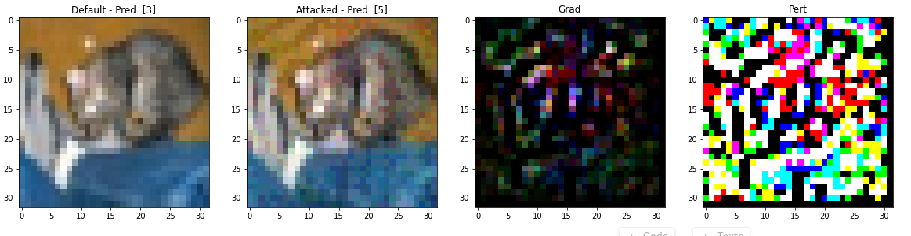
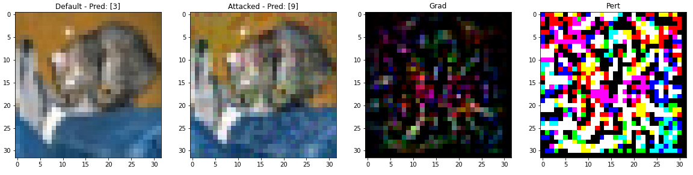

# Adversarial-examples

#### 👨‍🎓 This project was carried out during my master's degree in computer vision at URJC - Madrid

Introduction to adversarial examples - Deepl learning

## Goals

- Changing the prediction result of an image classification without changing its visual to the human eye

## Requirements

* Python 3.7+
* Jupiter notebook
* matplotlib >= 3.3
* tensorflow >= 2.6

How to install all the requirements :
```bash
$ pip install -r requirements.txt
```

## Usage

```bash
$ jupyter notebook Adversarial\ examples\ -\ Deep\ learning.ipynb
```

## Results

<p align="center">
  
</p>
<p align="center">
  <i>Changing the result of the prediction to a random class (Non-directed), class 3 to 5 (random)</i>
</p>

<p align="center">
  
</p>
<p align="center">
  <i>Changing the result of the prediction to a specific class (Directed), class 3 to 9</i>
</p>

## Structure

    .
    ├── Adversarial examples - Deep learning.ipynb
    ├── imgs
    │    ├── result1.png
    │    └── result.png
    ├── README.md
    └── requirements.txt


## Authors

* **Luis Rosario** - *Initial work* - [Luisrosario2604](https://github.com/Luisrosario2604)
